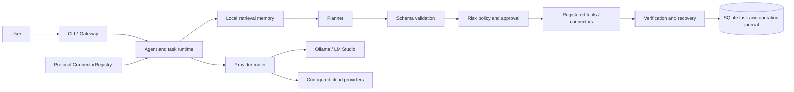

<div align="center">
  
  <h1>OpenArva</h1>
  <p><strong>Your personal AI agent for coding, research, and everyday automation.</strong></p>
  <p>
    <a href="https://www.npmjs.com/package/@openarvaai/agent"></a>
    <a href="LICENSE"></a>
    <a href="SECURITY.md"></a>
  </p>
</div>

Official project home: `openarvaai-agent/openarva`
npm package: `@openarvaai/agent`

OpenArva is a personal AI agent you can run from your computer to help with coding, research, and practical tasks. It works with configured local or cloud AI models, can use local memory, and can take actions through tools with permission and approval controls. OpenArva is not AGI or ASI; integrations listed as scaffolds are clearly distinguished from working connectors below.

### Why OpenArva

- A personal assistant for coding, research, and useful day-to-day automation
- Local memory and a choice of supported local or cloud AI models
- Autonomous task lifecycle with resume, retry, verification, and recovery
- Tool execution behind permission checks and approval policies
- Optional messaging connectors, with working integrations distinguished from scaffolds

## Quickstart

Requirements: Node.js 20+ and npm. For local inference or semantic embeddings, optionally install [Ollama](https://ollama.com/).

### Install from npm

```bash
npm install --global @openarvaai/agent
openarva init
openarva --help
```

The `openarvaai` executable is also installed as an alias. To try without a global install:

```bash
npx --package @openarvaai/agent openarva init
```

### Run from source

```bash
git clone https://github.com/openarvaai-agent/openarva.git
cd openarva
npm install
npm run build
npm test
node dist/index.js init
```

The npm package is `@openarvaai/agent`; the source repository is `openarvaai-agent/openarva`.

Copy `.env.example` to `.env` and add your provider credential there; `.env` is ignored by Git. `openarva init` stores non-secret provider settings in the local OpenArva config and does not prompt for or persist API keys. For a first request:

```bash
openarva run --domain coding --instruction "Explain the main modules in this repository"
```

Provider credentials may also be supplied by environment variables such as `OPENAI_API_KEY`, `ANTHROPIC_API_KEY`, or `GEMINI_API_KEY`. Never put real secrets in source code, issue comments, or committed `.env` files.

## Capabilities and integration status

Status reflects code in this repository, not third-party service availability.

| Area | Working implementation | Boundaries |
| --- | --- | --- |
| AI providers | OpenAI, Anthropic, Gemini, Mistral, Groq, DeepSeek and additional configured providers; local Ollama/LM Studio routing | Provider access requires valid credentials/models. Local-only mode disables cloud routing and fallback. |
| Agent runtime | Profile-based model routing, autonomous task plans, Zod tool schemas, SQLite task state, verification, bounded retries/replanning, explicit resume | Actions with side effects are permission-gated; uncertain external actions are not automatically replayed. |
| CLI and workspace tools | Setup, doctor, status, local indexing, sandboxed command execution, workspace search/edit | Commands are allowlisted and sandboxed; file changes require approval. |
| Memory | Local SQLite vector index; task/error history, chat/context, user preference and indexed-file records; Ollama embedding option | Ollama embeddings are model-backed semantic vectors. Without that configuration, retrieval uses deterministic feature-hash vectors and is approximate lexical retrieval. |
| Telegram | Telegram Bot API polling and send | Inbound handling requires `TELEGRAM_ALLOWED_CHAT_IDS`. |
| Discord | Discord Gateway `MESSAGE_CREATE` events and REST text replies | Opt in with `OPENARVA_CONNECTORS=discord`; requires `DISCORD_BOT_TOKEN`, `DISCORD_ALLOWED_CHANNEL_IDS`, and the Message Content Intent enabled in the Discord developer portal. Both inbound and outbound channels are allowlisted. |
| WhatsApp | Twilio WhatsApp outbound and signed webhook ingress | Requires Twilio configuration, canonical webhook URL, and sender allowlist. Meta WhatsApp Cloud API is not implemented. |
| GitHub | Public repository, issue, pull-request and commit crawler | This is a crawler, not a Discussions/Issues messaging bot. |
| Web and vision | Public web fetch and configured-provider image analysis | Public fetch is bounded and DNS-pinned. Local-only image analysis requires a configured local vision model. |
| Connector registry | Protocol contracts, normalized event schema, lifecycle registry and a 58-service catalog | Catalog entries are not integrations. Only entries marked implemented in source have working connector behavior. |

The catalog in [`src/connectors/platformCatalog.ts`](src/connectors/platformCatalog.ts) covers enterprise chat, consumer messaging, social messaging, project/incident notifications, and email/SMS/voice/push. Slack, Teams, Meta WhatsApp API, social DMs, project-management APIs, universal email, and most other catalog entries are **scaffolds/placeholders**, not production adapters. Twilio SMS/Voice is partial. SIP/telephony, MCP tools and standalone web connector capabilities also have implementation limits documented in the catalog and source. In particular, no production connector is claimed for unsupported services.

## Architecture



- **Provider routing:** capability profiles include fast, reasoning, coding, vision, and research.
- **Autonomous execution:** the runtime plans bounded steps, validates tool input, applies risk and approval rules, records results, verifies completion, and allows explicit recovery.
- **Connector registry:** connector modules normalize inbound events to `OpenArvaMessage` and declare their protocols, readiness, configuration schema, and lifecycle.
- **Persistence:** task and operation state uses SQLite; vector memories use `~/.openarva/memory/vectors.sqlite`.
- **Local-first behavior:** provider, embedding, and image routing honor local-only restrictions. OpenArva does not silently fall back to a cloud model when local-only mode is enabled.

## Vector memory

Memory is stored locally in SQLite at `~/.openarva/memory/vectors.sqlite`. It indexes completed/failed autonomous task history (including errors and tool summaries), chat context, preferences recorded through `OpenArvaMemory`, and files added with `openarva learn --index`.

### Local semantic embeddings with Ollama

Install and run Ollama locally, pull an embedding model, then configure:

```bash
ollama pull nomic-embed-text
```

```dotenv
OLLAMA_BASE_URL=http://127.0.0.1:11434
OPENARVA_EMBEDDING_MODEL=nomic-embed-text
```

Index documents and run a task:

```bash
openarva learn --index ./docs
openarva run --autonomous --instruction "Summarize the decisions documented about deployment"
```

When an embedding model is configured, indexing and search call Ollama's local embedding endpoint and compare same-model vectors with cosine similarity. The endpoint is restricted to loopback and requests do not follow redirects. An unavailable or invalid configured embedding service reports an error; it does not switch to a cloud embedding provider. Without the model setting, OpenArva uses deterministic local feature-hash vectors as a dependency-free approximate lexical fallback—not a neural semantic embedding model.

Task and preference text is redacted for supported sensitive-data patterns before vector persistence. This is defense in depth, not a guarantee that all private information is identified. Protect the local database using operating-system account and disk protections. `openarva learn --forget` removes local memory files.

## Security and privacy

- **Local-only mode:** set `OPENARVA_LOCAL_ONLY=true`; configure `LOCAL_AI_PROVIDER=ollama` (or another supported local provider) and a loopback endpoint. Cloud provider overrides and cloud vision transmission are rejected.
- **Sandbox execution:** workspace commands are constrained by allowlists, use non-shell execution paths where supported, and have timeout/cancellation bounds. File writes and higher-risk operations require approval.
- **Human approval:** `MODERATE` and `HIGH_RISK` tool actions require interactive approval; `--yes`/`--force` do not authorize them. Unattended execution is denied where approval is required.
- **Credentials:** load provider and connector secrets from environment variables (for local development, use the ignored `.env` file). OpenArva config stores non-secret settings only; memory/log text redacts common credential forms. Rotate exposed secrets. Never log tokens or commit credentials.
- **Network controls:** public HTTP utilities pin DNS results and reject private/reserved address ranges. Webhooks use authentication, replay protection, and rate limits where implemented. Configure HTTPS at the public ingress.
- **Data handling:** memory is local by default, but prompts sent to a configured cloud model leave the machine unless local-only mode is active. Review provider terms and redact sensitive data appropriately.
- **Connector plugins:** dynamically loaded JavaScript modules run with the process's privileges. Load only trusted modules and audit their network/authentication implementation.

See [`SECURITY.md`](SECURITY.md) for vulnerability reporting and deployment guidance.

## CLI reference

| Command | Purpose |
| --- | --- |
| `openarva init` / `openarva setup` | Interactive setup |
| `openarva doctor` | Diagnose runtime, configuration and provider connectivity |
| `openarva run --domain coding --instruction "..."` | Run a standard agent task |
| `openarva run --autonomous --instruction "..."` | Run a bounded planned task |
| `openarva resume <task-id>` / `openarva resume --pending` | Resume a persisted task explicitly |
| `openarva learn --index ./docs` | Index files into local memory |
| `openarva learn --forget` | Clear local memory |
| `openarva gateway daemon` | Start the multi-channel gateway |
| `openarva crawl git owner/repository` | Crawl GitHub repository metadata and activity |
| `openarva status` / `openarva tasks` | Show runtime or task status |
| `openarva --help` | Show available commands |

## Connector framework

The public API is exported from `src/connectors/index.ts`. Register a connector implementing `ProtocolConnector`, and enable it with `OPENARVA_CONNECTORS=connector-id`. Custom trusted modules can be loaded using comma-separated `OPENARVA_CONNECTOR_MODULES` package specifiers or paths. Each connector must implement start/stop/send, declare supported protocols, validate configuration, authenticate its vendor requests, and emit validated `OpenArvaMessage` events. The registry rejects enabling a catalog placeholder without a loaded implementation and enforces an inbound per-sender rate limit.

Example import:

```ts
import { ConnectorRegistry } from '@openarvaai/agent/dist/connectors/index.js';
```

Vendor-specific OAuth, signatures, replay defenses, token refresh, media download, and API rate limits must be implemented by the connector; a registry entry alone does not provide them.

## Development

```bash
npm install
npm run build
npm test
```

Use TypeScript with NodeNext ESM imports (including emitted `.js` extensions). Add focused tests for new tools, providers, or connectors. See [`CONTRIBUTING.md`](CONTRIBUTING.md) for contributor setup.

## Project links

- Source repository: <https://github.com/openarvaai-agent/openarva>
- Issues: <https://github.com/openarvaai-agent/openarva/issues>
- npm package: <https://www.npmjs.com/package/@openarvaai/agent>
- License: MIT
